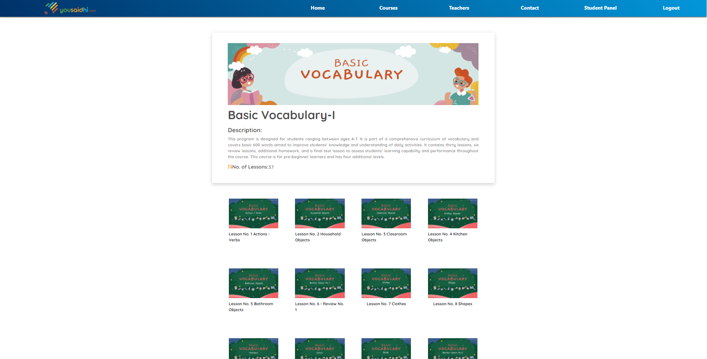
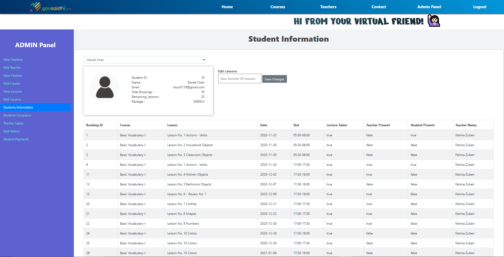
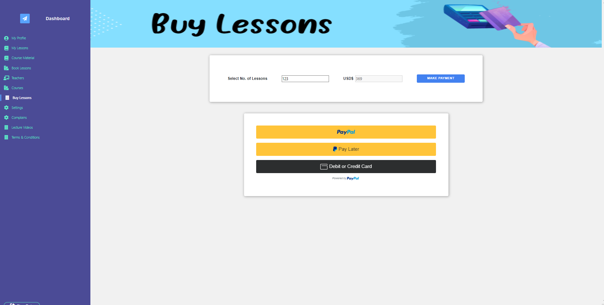

# YOUSAIDHI

Yousaidhi is an english learning platform where students can register and buy lessons. The student can then utilize the bought lessons to book a lesson with any preferred teacher for any preferred course and it's corresponding lesson number. It is a complete solution with Paypal integrated for payment method.

This application is build using Python-Flask framework.

## Screenshots

Main Page -


Courses -



Student Panel -


Admin Panel -



Buying Lessons -


## Installation

Clone and install the requirements from requirements.txt

```bash
  pip install -r requirements.txt 
```

Once the requirements are properly installed, run the application from run.py .

```bash
  python run.py 
```

To add paypal credentials change the following accordingly in templates/student_panel.html
```bash
.
.
1304        var PAYPAL_CLIENT = 'ADD CLIENT KEY HERE';
1305        var PAYPAL_SECRET = 'ADD SECRET KEY HERE\n';
.
.
```
## Support

For support, email muhammadbassam73@gmail.com.

